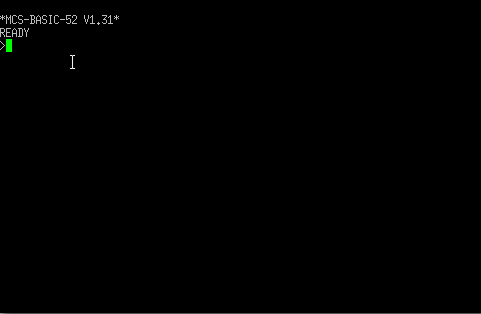

# 8052AH-BASIC

The aim of this project is to recall the good old days when electronics were still being used at school.

```console
*MCS-BASIC-52 V1.31*
READY
>
```


## Features :

- AT89S52 microcontroller with ROM V1.31 ;
- 8 KiB EPROM for BASIC I²C functions ;
- 32KiB RAM ;
- 8 KiB EEPROM for backup ;
- Integrated PIA 8255 ;
- SCALP-compatible expansion connector;
- IDE connector for hard disk;
- Address decoding with a GAL22V10;
- USB serial interface with FTDI232 module.


- The GAL JED file is generated using the utility [GALasm](https://github.com/daveho/GALasm) under linux.
- the programmer used is a [XGECU - pro](https://www.aliexpress.com/premium/XGecu.html)
- It is capable of programming AT89S52, E(E)PROMs, and Lattice GAL22V10.

## Peripheral Address :

| Peripheral | Address begin | Address end |
| ------ | ------ | ------ |
| RAM | #0000 | #7FFF |
| EPROM (2764) (/EA=1) | #2000 | #3FFF |
| EPROM (27128) (/EA=0) | #0000 | #3FFF |
| EEPROM (28C64) | #8000 | #9FFF |
| 8255 | #E000 | #E00F |
| EXTERNAL | #E010 | #E01F |

Two possibilities for this project :

- 80C32 processor and external EPROM 27128 (/EA=0) (not tested)
- AT89S52 processor with programmed Basic monitor and external EPROM 2764 (I2C functions) (/EA=1) (tested)

The card works without eprom and gal just with the ram. to do this, connect two wires to the dip 24 connector on gal22v10.

- A15 to /CSRAM (1 to 20)
- /RD to /OE (16 to 18)

## hardware


## Pia led Expander


## Some sample programmes (autobaud, but test with 9600 bauds)

- 1st test after reset and space bar to wake-up board


- LED test (add a cable to connector J1 between terminal 14 and 2)
- Led must be active in low level on PORT1 !!!



- Blink test and eeprom programming, run auto after reset


- Pia 8255 test and copy eeprom program into the ram


## Usefull links

- Elektormagazine [Elektormagazine](https://www.elektormagazine.fr/magazine/elektor-200703/10656)

- Dos4ever [dos4ever](https://www.dos4ever.com/8031board/8031board.html)


